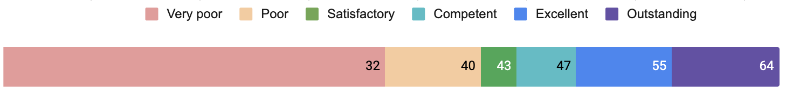

# Assessment score

## Description

Your assessment score reflects how well you mastered the crucial learning objectives in the current module. It takes into account your technical skills and soft skills. The main question this score is trying to answer is are you able to build the product requested by the client in a given technology stack and explain what skills you used in order to achieve that?

## Rules

You will need to answer 16 questions. For each question, you can receive 0-4 points. Your submission will be reviewed by two independent reviewers and the average number of points for each question will be calculated.

The maximum score is 64 points. Each answer scored as 0 or 1 is considered a missing or wrong answer.

In order to pass the assessment you need to get at least a Satisfactory level (>=41 points) and you cannot miss any of the questions (you need to get >=2 points) for all of the assessed learning objectives.

| **Score**      | **Level**    | **Description**                                                                                                                                               |
|----------------|--------------|---------------------------------------------------------------------------------------------------------------------------------------------------------------|
| 56-64 points   | Outstanding  | The majority of your answers exceed expectations. You are shining like a star!                                                                                |
| 48-55 points   | Excellent    | You got all the answers right or you missed the key elements in some of the answers but you were able to exceed expectations in other answers. Great job! |
| 44-47 points   | Competent    | You missed the key elements in only a few answers, but everybody makes some mistakes from time to time. Use error as a learning opportunity!                  |
| 41-43 points   | Satisfactory | You missed the key elements in some of the answers, but with effort and dedication, you can improve your performance. Keep the ball rolling!                  |
| _33-40 points_ | _Poor_       | _You need major improvement in your performance, as you missed the key elements in many answers. Don’t give up!_                                              |
| _≤32 points_   | _Very poor_  | _You were not able to answer most of the questions correctly. It's time to try again!_                                                                                                 |

## Rubric

You can check the rubric that includes all possible tasks [here](https://dashboard.microverse.org/student_assessments/rubrics).

Please note that each task is connected to one learning objective that was introduced in the current module and is scored from 0 to 4 points.

You will need to answer questions from the following groups:
- Presentation: *How well did you present your work?*
- The final product: *Did you manage to deliver the requested product?*
- Technical questions: *How well have you mastered the technical skills?*
- Coding challenge: *How well did you present your thought process while coding?*
- Soft skills: *How well have you mastered the soft skills?*

