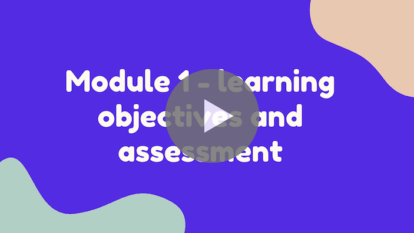
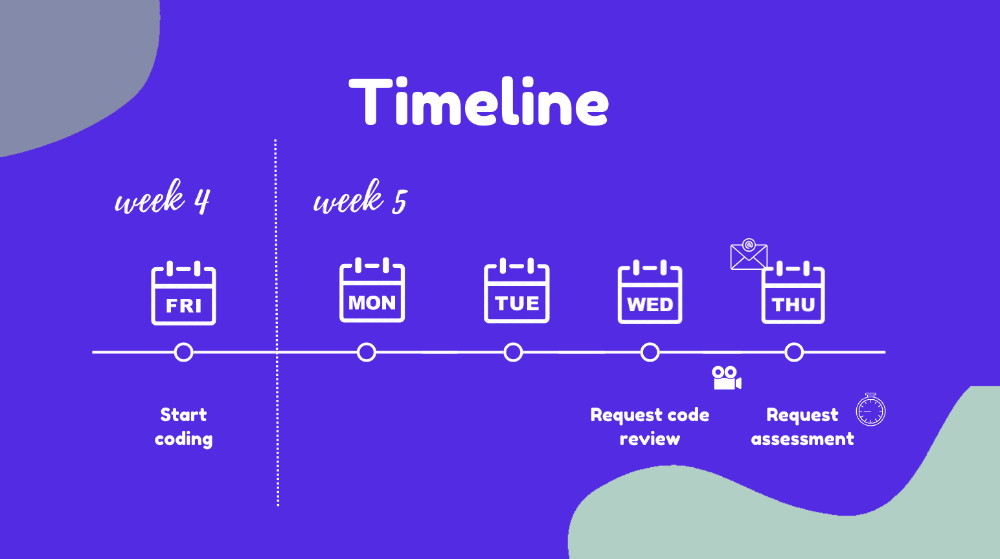
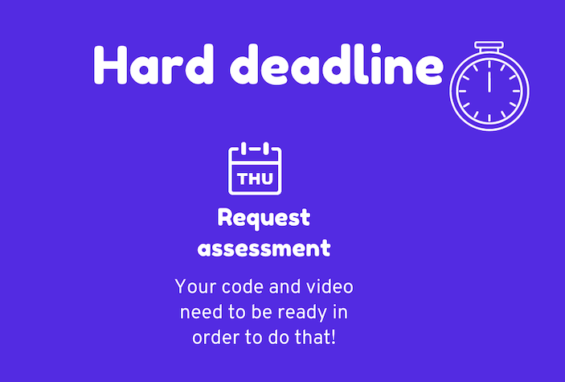
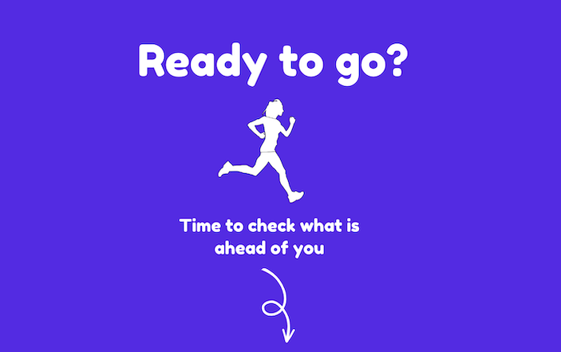

# Assessment: the main goal

## Learning objectives

- Recognize the importance of mastering learning objectives.

### Estimated time: 0.5h

## Why this project is different from any other project you’ve created at Microverse?

There are three reasons:

- This is the first project in which you will prove that you mastered the skills gained in the entire module.
- The hard deadline for this project is next Thursday. If you miss it there is no second chance!  ❗️⏰
    - *You need to request the assessment of your presentation video by Thursday 23:59 your program time. If you fail to submit your presentation by the deadline, it will be marked as incomplete and you will be asked to repeat the block.*
- You will need to deliver code and video presentation. **It is crucial: a good software developer must be able to talk about the code and present their work to others.**

## Learning objectives and assessment

At the beginning of the module you have watched a video explaining what the assessment looks like and how it uses learning objectives.
Let's watch it again!
 

[Watch the introduction](https://www.canva.com/design/DAFguDagXdY/tQecrFVu_XAmYB4BsA3IXw/view?utm_content=DAFguDagXdY&utm_campaign=designshare&utm_medium=link&utm_source=recording_view)

------------------------

## Timeline

As explained in the video, your assessment will deliver two products: your code and a video presentation. You will have 5 days to complete both:
- You start coding your project today: on Friday of week 4.
- You continue coding through Monday and Tuesday of week 5.
- On Wednesday of week 5 you should finish your coding project and ask for a code review. Remeber that:
    - You code must be approved.
    - If it doesn't meet all the requirements, reviewers will request changes.
    - You have up to 3 code reviews.
    - So you also need to plan the time for making changes requested by the reviewer.
- On Thursday you need to record your video presentation and request a review of the assessment.
     - You will receive a presentation outline with questions selected for you by email by midnight of the Wednesday on Week 5 (Wednesday 23:59 your program time). You will also be able to check it on the Dashboard.
     - Thursday is a hard deadline for requesting the assessment.  ❗️⏰
         - *You need to request the assessment of your presentation video by Thursday 23:59 your program time. If you fail to submit your presentation by the deadline, it will be marked as incomplete and you will be asked to repeat the block.*

------------------------

### Rules to remember

1. In order to be assessed you need to:
    1. Build a project according to the business requirements.
    2. Record a video presentation following the presentation outline assigned to you.
2. You need project approval before recording the presentation as you will need to show your code and the final product.
     - Your project needs to include code **created by you** that shows that you have mastered all learning objectives.
     - You will have a max of 3 code reviews to get your code approved.
4. You need to master all learning objectives but we will ask you to answer the questions about randomly selected learning objectives.
    - You will receive the list on the day of recording your presentation.
5. You need to request the assessment of your presentation video before the end of Thursday.  ❗️⏰
    - *You need to request the assessment of your presentation video by Thursday 23:59 your program time. If you fail to submit your presentation by the deadline, it will be marked as incomplete and you will be asked to repeat the block.*

  
  
  

------------------------

## Advice
  
In this module you have taken ownership of your learning process. You identified all the learning objectives at the beginning of the module and have covered the lessons and exercises that cover all of them. So begin by reflecting on your learning and look at all the learning objectives you have mastered! If you feel uncertain about some of them, begin by reviewing the related content or study it again as you build your project. 

This is your first big project. Imagine that you got the requirements from the client. Read them carefully and make sure that you did not miss anything!

Assume that the code reviewer will find some issues in your project. Plan a time to take care of them.

------------------------
  
 ## What to do now?
 
  

- Check [the rubric with all crucial learning objectives in this module](https://dashboard.microverse.org/student_assessments/rubrics).
- Check how you will be [scored during the assessment](https://github.com/microverseinc/curriculum-html-css/blob/main/capstone/articles/assessment_score.md).
- Take a sneak peek at the instructions for [preparing your presentation](https://github.com/microverseinc/curriculum-html-css/blob/main/capstone/presentation_rehearsals.md).
- Take a sneak peek at [the project requirements and get excited](https://github.com/microverseinc/curriculum-html-css/blob/main/capstone/business_requirements.md)!
---

*If you spot any bugs or issues in this activity, you can [open an issue with your proposed change](https://github.com/microverseinc/curriculum-transversal-skills/blob/main/git-github/articles/open_issue.md).*
