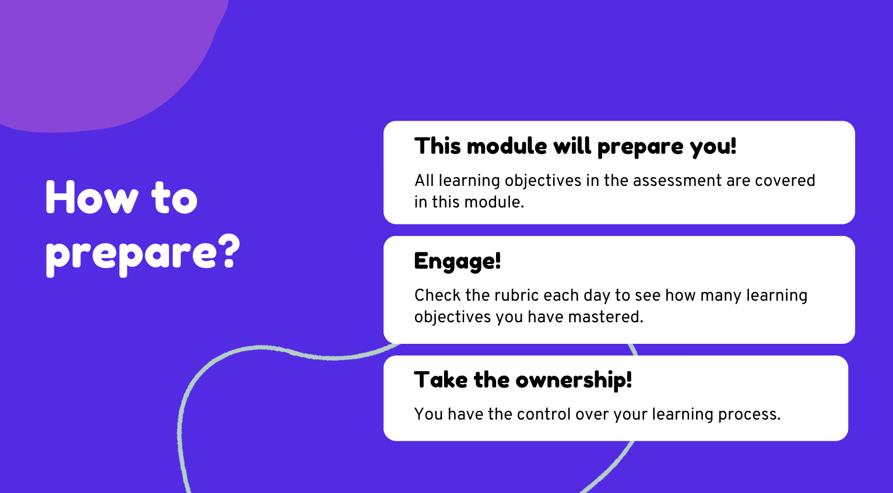

# Morning session: Module 1 - learning objectives and assessment

### Learning objectives

- Recognize the importance of mastering learning objectives.

### Estimated time: 0.5h

## Description

In this lesson you will see what project you will be able to build after mastering all learning objectives assigned in this module. You will also learn how you will be assessed and you will discover how to prepare for this assessment.

### Why is it important?

In order to foster your learning process you need to understand what your goal is. This goal is described with learning multiple objectives. Those objectives can guide you through all activities in this module, so you always understand why you are learning about specific things and what knowledge and skills we expect you to master.

Thanks to that you have more ownership over your learning process and also more confidence in your progress! Besides, you can also get excited today about the things you’re about to build in a few weeks!

### Learning objectives and assessment in module 1

First, you will watch this intro video together: 
 

[Watch the introduction](https://www.canva.com/design/DAFguDagXdY/tQecrFVu_XAmYB4BsA3IXw/view?utm_content=DAFguDagXdY&utm_campaign=designshare&utm_medium=link&utm_source=recording_view)

Now, check the following documents:

- Check [the rubric with all crucial learning objectives in this module.](https://dashboard.microverse.org/student_assessments/rubrics)
- Check how you will be [scored during the assessment.](https://github.com/microverseinc/curriculum-html-css/blob/main/capstone/articles/assessment_score.md)
- Take a sneak peek at the instructions for [preparing your presentation](https://github.com/microverseinc/curriculum-html-css/blob/main/capstone/presentation_rehearsals.md).
- Take a sneak peek at [the project requirements and get excited](https://github.com/microverseinc/curriculum-html-css/blob/main/capstone/business_requirements.md)!

**You will come back to those documents and get more details about the project itself in the last week of the module. Now it's time to learn and master those objectives!**

### Discussion

- Did you all understand the way you will be assessed?
- Do you all understand how to check learning objectives while working in this module?
- Are you excited about the things you will learn in this module?

*In case of any questions, please reach out to the Student Success Team!*

---

*If you spot any bugs or issues in this activity, you can [open an issue with your proposed change](https://github.com/microverseinc/curriculum-transversal-skills/blob/main/git-github/articles/open_issue.md).*
