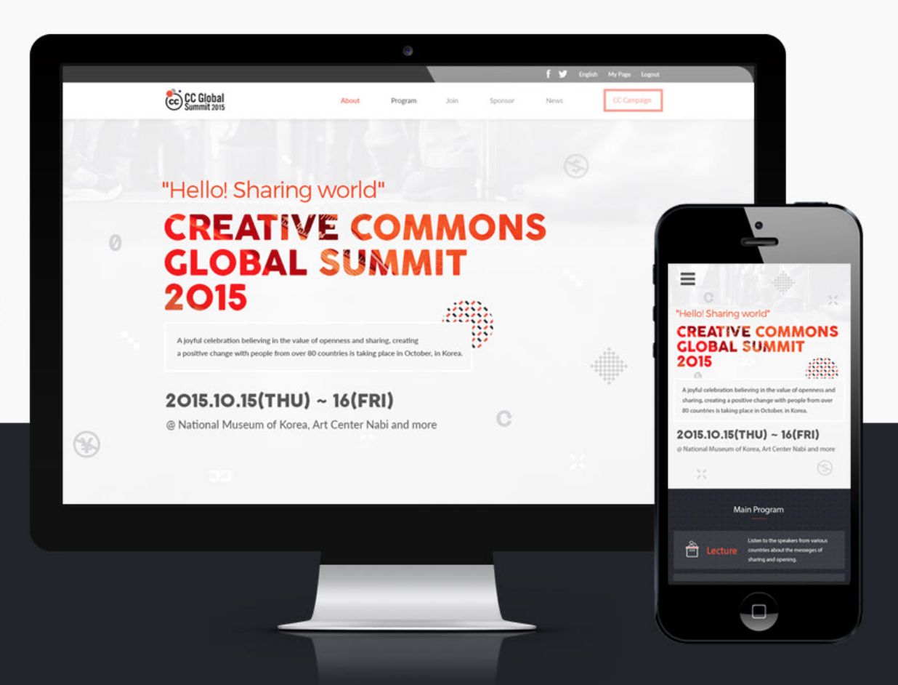

# HTML/CSS & JavaScript capstone project - Conference page

## Learning objectives

- Understand how to use medium-fidelity wireframes to create a UI.
- Follow written requirements (e.g. user stories).
- Use semantic HTML tags.
- Apply best practices in HTML code.
- Use CSS selectors correctly.
- Use CSS box model.
- Use Flexbox to place elements in the page.
- Use images and backgrounds to enhance the look of a website.
- Demonstrate ability to create UIs adaptable to different screen sizes using media queries.
- Use GitHub Pages to deploy web pages.
- Apply JavaScript best practices and language style guides in code.
- Use JavaScript to manipulate DOM elements.
- Use JavaScript events.
- Use objects to store and access data.

### Estimated time: 19.5h

## Description

In this capstone project ([remember what capstones are?](https://github.com/microverseinc/curriculum-html-css/blob/main/articles/capstone_intro.md)), you are going to build a website based on an *online website for a conference*, but adapted to new content or another purpose. We provide some design guidelines for you to create the website, but **you must personalize the content**, i.e., instead of a conference you can build a website for a concert or for a web development course. It's very important that you personalize your project so that you have something unique in your portfolio to share with potential employers during job searching.

  

*IMPORTANT NOTE: Read **all** requirements before you start building your project.*

### General requirements

- Make sure that there are [no linter errors](https://github.com/microverseinc/linters-config).
- Make sure that you used correct [GitHub flow](https://github.com/microverseinc/curriculum-transversal-skills/blob/main/git-github/articles/github_flow.md).
- Make sure that you documented your work [in a professional way](https://github.com/microverseinc/curriculum-transversal-skills/blob/main/documentation/articles/professional_repo_rules.md).

### HTML/CSS & JavaScript requirements

- Follow our list of [best practices for HTML & CSS](https://github.com/microverseinc/curriculum-html-css/blob/main/articles/html_css_best_practices.md).
- Follow our list of [best practices for JavaScript](https://github.com/microverseinc/curriculum-html-css/blob/main/articles/javascript_best_practices.md).

### Project requirements

- You should personalize the content of your page. Choose a topic that is different than the one in the original design.
- You should follow these [design guidelines](https://www.behance.net/gallery/29845175/CC-Global-Summit-2015), including:
  - Colors.
  - Typography: font face, size, and weight (we suggest using [Lato](https://www.latofonts.com/) as it is a free font similar to the one used in the original design).
  - Layout: composition and space between elements.
- The pages should look almost identical to the original design. Small adjustments like text or image changes are acceptable.
- You can use a CSS framework (for example Bootstrap) for styling, if you want to.
- You should build only these 2 pages:
  - The *home page*.
  - The *about page*.
- Each of these pages should have versions for 2 different screen sizes: 
  - Mobile: up to 768px wide.
  - Desktop: 768px or wider.

- Interactions
  - Links
    - The *home page* should have a link in the menu to the *about page*.
    - The logo in the header links to the *home page*.
  - Mobile menu
    - When the user clicks (or taps) the hamburger button on the header, the mobile menu appears over the page.
    - There are no guidelines for the mobile menu in the docs, but you should implement it so it is consistent with the design (colors, typography, spacings, etc).
    - The mobile menu should have a close (X) button that closes the menu.
- Dynamic page
  - The section "Featured speakers" should be created dynamically in JavaScript.
  - You should use a JavaScript variable with the data about the speakers and use it when the page loads to create the HTML for this section dynamically.

Original design idea by [Cindy Shin in Behance](https://www.behance.net/adagio07).

The [Creative Commons license of the design](https://creativecommons.org/licenses/by-nc/4.0/) requires that you give appropriate credit to the author. Therefore, you must do it in the README of your project.

## Challenge breakdown

In order to tackle this challenge, you need a plan! We created high-level milestones for you. Your job is to make them more detailed.

### Day 1

**Milestone 0 - project setup (0.5h)**
- Set up the repository and tools.

**Milestone 1 - content (1h)**
- Choose the topic for your website.
- Choose images, text, icons, fonts (we suggest using [Lato](https://www.latofonts.com/) as it is a free font similar to the one used in the original design).

**Milestone 2 - mobile first (3h)**
- Create the 1st page for mobile.

### Day 2

**Milestone 3 - deploy mobile version (4h)**
- Create the 2nd page for mobile.
- Deploy the project.

**Milestone 4 - start desktop version (2.5h)**
- Adapt the 1st page to desktop.

### Day 3

**Milestone 5 - desktop version (2.5h)**
- Adapt the 2nd page to desktop.

**Milestone 6 - dynamic page (4h)**

- Implement the section "Featured..." with dynamic HTML. In the conference website it's "Featured speakers" but you can adapt it to the relevant content for your own website.  
- Deploy the project and check to make sure everything works as planned.

### Day 4 - code review

**Milestone 7 - interactions (4h)**
- Implement the user interactions: link, mobile menu.
- Deploy the project.

**Milestone 8 - code review**
- Ask for a code review as soon as possible, so you have enought time to make corrections.

## Work and submission mode

- You should submit this activity **individually.**

## Code review

You will get a code review when you build the complete project, not after each milestone. When you have it ready, follow [these steps](https://github.com/microverseinc/curriculum-transversal-skills/blob/main/code-review/articles/how_to_ask_for_a_code_review.md) to request a code review of your project. **You should create one pull request with the complete code of your app.**

## Submit your project

After the final approval from a code reviewer, you need to submit your project.
[Read this FAQ for a reminder on how to submit your project](https://microverse.zendesk.com/hc/en-us/articles/360061344234).

Now go to your Student Dashboard and submit your project.

## Assessment

This project will be used in the video presentation that you need to record.

In the presentation, you will need to show us the evidence that you have mastered a set of randomly selected crucial learning objectives. 

****You will need the pieces of code written by you and your knowledge about specific concepts.****

You will be assessed by 2 independent assessors according to:

- [the score description](https://github.com/microverseinc/curriculum-html-css/blob/main/capstone/articles/assessment_score.md)
- [the rubric](https://dashboard.microverse.org/student_assessments/rubrics)

Both documents above should be the guidelines for you to create a solid presentation. Remember that it is up to you to prove that you have mastered all crucial learning objectives.

*Once you finish building the project, you will move to the activity in your dashboard that will ask you [to record the video presentation](https://github.com/microverseinc/curriculum-html-css/blob/main/capstone/record_presentation.md).*

⏰ ❗️  *You will need to request the assessment of your presentation video by Thursday 23:59 your program time. If you fail to submit your presentation by the deadline, it will be marked as incomplete and you will be asked to repeat the block.*

## Additional requirements

*These are all optional, but if you're interested in exploring this topic further, feel free to implement them. Any exploration here should be done outside program time.*

*If you decide to implement these requirements you should do it in a separate pull request. As always, remember to clearly document your decision in GitHub comments.*

- You could implement some UX improvements: add the "More" button on the home page, include transitions and/or animations, etc.
- You could implement additional pages, like the *tickets page* and the *schedule page*. Make sure that you have a decent mobile design for them.

------

_If you spot any bugs or issues in this activity, you can [open an issue with your proposed change](https://github.com/microverseinc/curriculum-transversal-skills/blob/main/git-github/articles/open_issue.md)._
