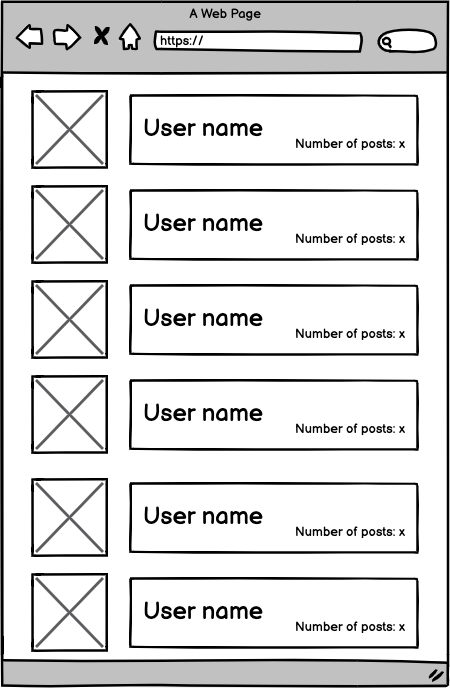

# Blog app - controllers

## Learning objectives
- Use controllers to handle requests and render empty views.
- Understand Rails naming conventions.
- Use params from browser requests in a safe way.

### Estimated time: 3.5h

## Description
In this project, you will create all controllers and views for your Blog app. As you won't be processing any data yet, you will add simple placeholders for your views with plain HTML.

*IMPORTANT NOTE: Read **all** requirements before you start building your project.*

### General requirements

- Make sure that there are [no linter errors](https://github.com/microverseinc/linters-config).
- Make sure that you used correct [Gitflow](https://github.com/microverseinc/curriculum-transversal-skills/blob/main/git-github/articles/gitflow.md).
- Make sure that you documented your work [in a professional way](https://github.com/microverseinc/curriculum-transversal-skills/blob/main/documentation/articles/professional_repo_rules.md).

### Ruby requirements
- Follow our list of [best practices for Ruby](https://github.com/microverseinc/curriculum-ruby/blob/main/articles/ruby_best_practices.md).

### Project requirements
-  **Important:** do NOT use `rails generate scaffold` command. The point of this project is to show you how to set up controllers by yourself.
-  Take a look at the wireframes below. Make sure that your app handles the URLs used in the wireframes:  

  
  
  
  

-  For each URL you should create:
    - A route.
    - An action in the correct controller.
    - A view file.

-  View files should include only placeholders written in plain HTML, e.g:
    - Here is a list of posts for a given user

-  Make sure that you added code to handle **only** the 4 required URLs.

###### Make sure that when you run the `rails routes` command in your console, you can see the following output:

### Need a big picture? 

Remind me about [the big picture of this project](../sneak_peek.md).

## Work and submission mode

- You should submit this activity **individually.**

## Code review

Follow [these steps](https://github.com/microverseinc/curriculum-transversal-skills/blob/main/code-review/articles/how_to_ask_for_a_code_review.md) to request a code review of your project.

## Submit your project

After the final approval from a code reviewer, you need to submit your project.
[Read this FAQ for a reminder on how to submit your project.](https://microverse.zendesk.com/hc/en-us/articles/360061344234)
Now go to your Student Dashboard and submit your project.

------

_If you spot any bugs or issues in this activity, you can [open an issue with your proposed change](https://github.com/microverseinc/curriculum-transversal-skills/blob/main/git-github/articles/open_issue.md)._
