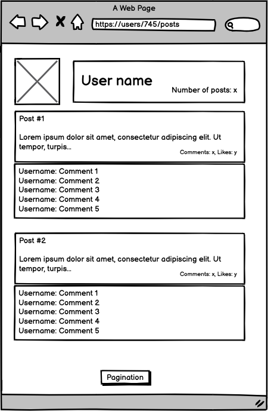
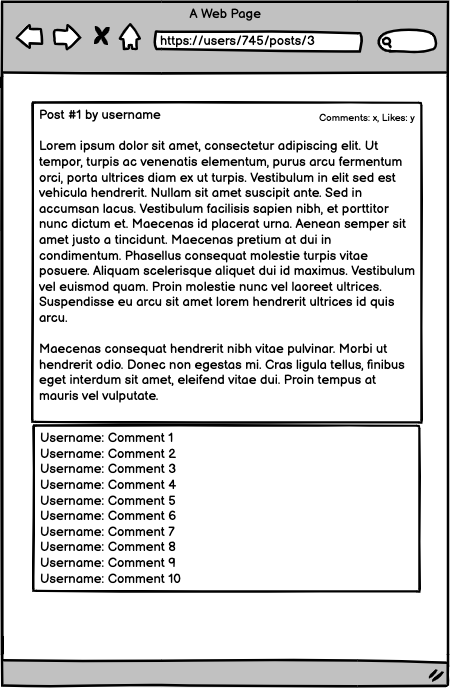

# Sneak peek: Blog app

## Learning objectives

- Diagram a data model clearly and explain what it's doing.
- Understand how to use medium-fidelity wireframes to create a UI.

### Estimated time: 0.5h

## Description

The Blog app will be a classic example of a blog website. You will create a fully functional website that will show the list of posts and empower readers to interact with them by adding comments and liking posts.

### How to build the Blog app

The end result should follow the following data model (this is an Entity Relationship Diagram that you are already familiar with):

  

For this project you will have full freedom in terms of visual design but you will need to keep the following wireframes:

  
  
  

  
  

You will be guided step by step, and because of that you will have a chance to practice your knowledge about basic Ruby on Rails concepts - starting from the Views and finishing the database connection. You will also implement ideas like authentication, authorization, and all kinds of tests. In the last step, you will have a chance to create an API instead of API consumption.

### Projects list

You will be building the Blog app for three weeks. Here is the list of projects that will guide you through the steps described above. You will find details about each of the milestone requirements in the upcoming program activities.

- Project 1: Setup and controllers.
- Project 2: Controllers specs.
- Project 3: Creating a data model.
- Project 4: Processing data in models.
- Project 5: Views.
- Project 6: Forms
- Project 7: Validations, Model specs, and n+1 problems.
- Project 8: Add Devise.
- Project 9: Add authorization rules.
- Project 10: Integration specs for Views.
- Project 11: Add API endpoints.
- Exercise: API documentation.

------

_If you spot any bugs or issues in this activity, you can [open an issue with your proposed change](https://github.com/microverseinc/curriculum-transversal-skills/blob/main/git-github/articles/open_issue.md)._
