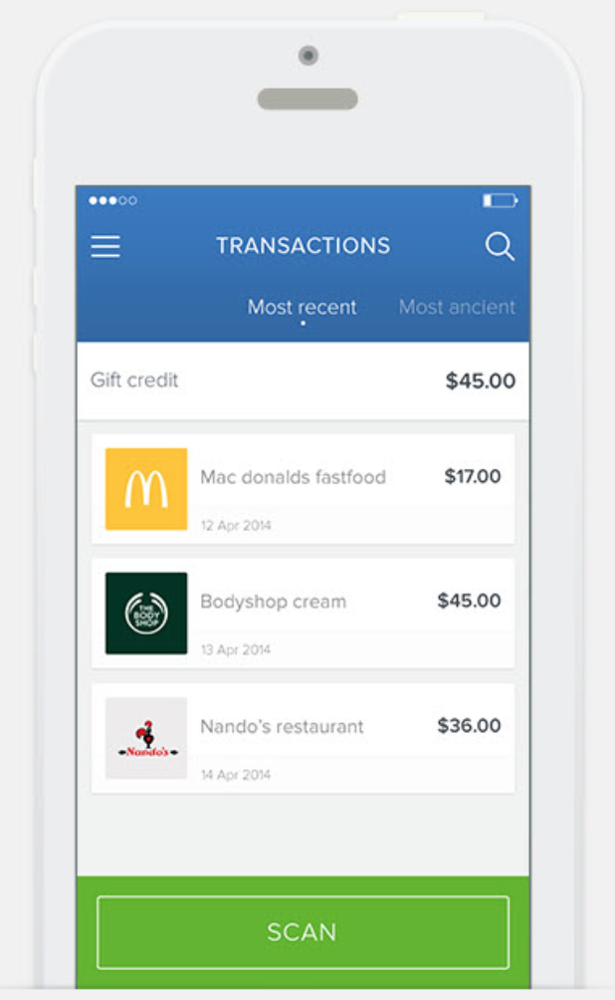

# Ruby on Rails capstone project - Budget app

## Learning objectives

- Use ruby gems as software packages system.
- Install Ruby on Rails framework.
- Understand Rails RESTful design and router.
- Use controllers to handle requests and render empty views.
- Use params from browser request in a safe way.
- Use preprocessed html file with embedded Ruby code.
- Use layouts and templates for shared content.
- Use database migration files to maintain database schema.
- Use validations for models.
- Secure app from n+1 problems.
- Understand what ORM is.
- Write SQL queries with ActiveRecord.
- Set up associations between models.
- Build a webapp that requires the user to log in.
- Use devise gem for authentication.
- Limit access to webapp resources based on authorization rules.
- Analyze in writing why you have made a coding choice using one structure over another.

### Estimated time: 19.5h

## Description

The Ruby on Rails capstone project ([remember what they are?](https://github.com/microverseinc/curriculum-html-css/blob/main/articles/capstone_intro.md)) is about building a mobile web application where you can manage your budget: you have a list of transactions associated with a category, so that you can see how much money you spent and on what. 

You will create a Ruby on Rails application that allows the user to:
- register and log in, so that the data is private to them.
- introduce new transactions associated with a category.
- see the money spent on each category.

  

*IMPORTANT NOTE: Read **all** requirements before you start building your project.*

### General requirements

- Make sure that there are [no linter errors](https://github.com/microverseinc/linters-config).
- Make sure that you used correct [gitflow](https://github.com/microverseinc/curriculum-transversal-skills/blob/main/git-github/articles/gitflow.md).
- Make sure that you documented your work [in a professional way](https://github.com/microverseinc/curriculum-transversal-skills/blob/main/documentation/articles/professional_repo_rules.md).

### Ruby requirements

- Follow our list of [best practices for Ruby](https://github.com/microverseinc/curriculum-ruby/blob/main/articles/ruby_best_practices.md).

### Project requirements

#### Design
- You should follow these [design guidelines](https://www.behance.net/gallery/19759151/Snapscan-iOs-design-and-branding?tracking_source=), including:
  - Colors.
  - Typography: font face, size and weight.
  - Layout: composition and space between elements.

> NOTE: In these design guidelines there are several UIs that you won't need for this exercise; also, some pages are not given a design and you will create them following the design guidelines of the other pages.

Original design idea by [Gregoire Vella on Behance](https://www.behance.net/gregoirevella).

The [Creative Commons license of the design](https://creativecommons.org/licenses/by-nc/4.0/) requires that you give appropriate credit to the author. Therefore, you must do it in the README of your project.

#### Interactions
- Splash screen
  - A simple page with the name of your app (yes, you need to choose one), and links to the sign up and log in pages.

- Sign up and log in pages
  - The user should be able to register in the app with full name, email and password (all mandatory).
  - The user can log into the app using email and password.
  - If the user is not logged in, they can't access pages that require the user to be logged in (all the pages described below).

- Home page (categories page)
  - When the user logs in, they are presented with the categories page.
  - For each category, the user can see their name, icon and the total amount of all the transactions that belongs to that category.
  - When the user clicks (or taps) on a category item, the application navigates to the transactions page for that category.
  - There is a button "add a new category" at the bottom that brings the user to the page to create a new category.

- Transactions page
  - For a given category, the list of transactions is presented, ordered by the most recent.
  - At the top of the page the user could see the total amount for the category (sum of all of the amounts of the transactions in that category).
  - There is a button "add a new transaction" at the bottom that brings the user to the page to create a new transaction.
  - When the user clicks on the "Back" button (<), the user navigates to the home page.

- "Add a new category" page
  - The user fills out a form to create a new category, indicating their name and icon (both mandatory).
  - The user clicks (or taps) the "Save" button to create the new category, and is taken to the home page on success.
  - When the user clicks on the "Back" button (<), the user navigates to the home page.

- "Add a new transaction" page
  - The user fills out a form to create a new transaction with:
    - name (mandatory)
    - amount (mandatory)
    - categories (mandatory at least one)
  - The user click (or taps) the "Save" button to create the new transaction, and is taken to the transactions page for that category.
  - When the user clicks on the "Back" button (<), the user navigates to the transactions page for that category.

#### Testing requirements
- Create unit and integration tests for all the most important components of your RoR application.

#### Technical requirements

- You should use Postgres as your database.
- You should use devise for authentication.
- You should validate all user input to make sure that anyone with bad intentions cannot compromise your app.
- You can use a view template engine of your choice (.erb, .slim, .haml).
- The project should be deployed and accessible online.
- Your database schema should reflect the following structure:

> NOTE: do not change column names visible in the diagram. You need to change the "Entity"  name according to the theme you have chosen for your project (please note: "Transaction" is a name already used by ActiveRecord, so using it as a name for your model and table will result in an error).

  

### Project documentation

Once you have finished the development of the project, you should record a video presenting the features of the project you built. It is a video with a **maximum length of 5 minutes**. The content of the video should include:

- a description of the project.
- a demo of the project features.
- you should also highlight some interesting piece of code or something you built that you are very proud of.

For recording the video you can use tools like [Loom](https://www.loom.com/) that let you share a private link to the recording, and configure a shot that shows your computer screen and your face at the same time in a small picture.

## Challenge breakdown

Here is a suggestion of what you can do every day (just a suggestion, not mandatory):

### Day 1
- Set up the repository and tools.
- Create your models according to the ERD diagram. Don't forget about validations and tests.
- Implement the authentication and authorization. 

### Day 2

- Create the page to add a category.
- Create the home page.
- Create the page to add a transaction.
- Create the transactions page.

### Day 3

- Make sure your app is tested adequately.
- Deploy the project, and test for final details.
- Record a video for your project.
- Create a good README and PR description.

## Work and submission mode

- You should submit this activity **individually.**

## Code review

You will get a code review when you build the complete project, not after each milestone. Once you have it ready, follow [these steps](https://github.com/microverseinc/curriculum-transversal-skills/blob/main/code-review/articles/how_to_ask_for_a_code_review.md) to request a code review of your project.

## Submit your project

After the final approval from a code reviewer, you need to submit your project.
[Read this FAQ for a reminder on how to submit your project](https://microverse.zendesk.com/hc/en-us/articles/360061344234).

Now go to your Student Dashboard and submit your project.

## Additional requirements

*These are all optional, but if you're interested in exploring this topic further, feel free to implement them. Any exploration here should be done outside program time.*

*If you decide to implement these requirements you should do it in a separate pull request. As always, remember to clearly document your decision in GitHub comments.*

- You could implement some UX improvements: include transitions and/or animations, etc.
- Make sure that you have a decent desktop design for the webapp.
- Implement the left side menu to improve the navigability of the app.

------

_If you spot any bugs or issues in this activity, you can [open an issue with your proposed change](https://github.com/microverseinc/curriculum-transversal-skills/blob/main/git-github/articles/open_issue.md)._
