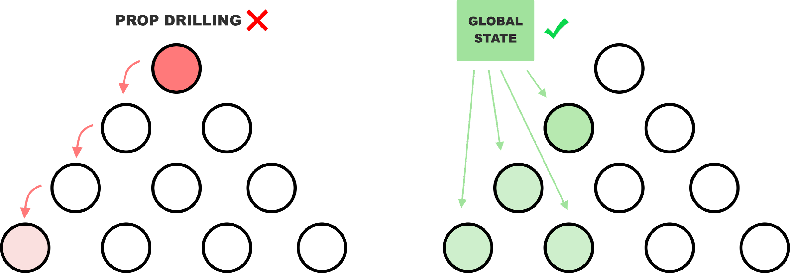

# Redux intro

## Learning objectives

- Understand the concept of global state management.
- Discover the downside to local state management: prop drilling
- Use Redux & Redux Toolkit documentation.

### Estimated time: 1h

## Description

In this lesson you'll discover one of the primary problems in large-scale React applications and one popular solution: global state management with Redux.js.

### Anti-pattern: prop-drilling

So far you've learned about React components that use the concept of `state`. However, you've only done that on a small scale: having a **component hierarchy of only a few levels deep**.

As your application grows you may need to control the state of 3 or more levels deep. This would force you to engage in **prop drilling**: _Passing down data/state as props to the intended destination through many different components that won't use it_.

- [What is Prop Drilling in React?](https://www.educative.io/answers/what-is-prop-drilling-in-react)

Prop drilling is considered a **bad practice** (also known as **anti-pattern**) and should be prevented.

Wouldn't it be easier to access a particular state variable from within a component directly? Yes it would be, and that's why the community has come up with a solution: **global state management**.

Instead of defining and updating state from with a parent component, you do so in a central place (called a `store`) and access your state and state modifiers directly!

### What is Redux?

React offers a native way of implementing global state management, through the [Context API](https://reactjs.org/docs/context.html). However, it isn't as commonly used in the industry.

A popular solution that is used to handle the concern of global state management is called [Redux.js](https://redux.js.org/).

- [Redux in 100 Seconds](https://www.youtube.com/watch?v=_shA5Xwe8_4)

Implementing Redux proved to be an overly complicated process. As a result, the team behind the library released an official library intended to be the standard way to write Redux logic: [Redux Toolkit](https://redux-toolkit.js.org/).

- [Why Redux Toolkit is How To Use Redux Today](https://redux.js.org/introduction/why-rtk-is-redux-today)
- [Modern Redux with Redux Toolkit](https://www.youtube.com/watch?v=14XGPHtoW1Y)

This is what we'll use as you go through this module!

**Remember that this lesson is just an introduction. You will learn more about the state, store, actions, reducers, and immutability in dedicated lessons.**

---

_If you spot any bugs or issues in this activity, you can [open an issue with your proposed change](https://github.com/microverseinc/curriculum-transversal-skills/blob/main/git-github/articles/open_issue.md)._
