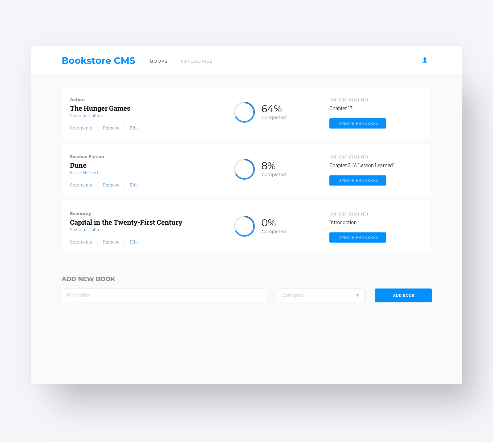

# Sneak peek: Bookstore

## Learning objectives

- Understand how to parse a Zeplin design to create a UI.

### Estimated time: 0.5h

## Description

The **Bookstore** is a website similar to the "Awesome Books" website built in the previous module.

You will create an simplified version of it that allows you to:

- Display a list of books
- Add a book
- Remove a selected book

By building this application, you will learn how to use React and Redux in the context of a real application.

### How to build the Bookstore website

You will need to build a website with two subpages:

- `/books`
- `/categories`

However, you will only need to implement the `/books` page (see the image below). The `/categories` page will stay empty in this MVP.

  

You can check the full design file in [Zeplin project](https://app.zeplin.io/project/5b35a9e13227086040f8eb75/screen/5b695e29bb8c844f118f9378) where you can also check the exact dimensions of all elements.

To log in to Zeplin, use the following credentials:

- Username: `student@microverse.org`
- Password: `jb077mL2dL0DfxJ`

**IMPORTANT NOTE** in case of problems with Zeplin login - please use [the project created by one of Microverse students - Usman Suleiman Babakolo](https://pedantic-beaver-cb923b.netlify.app/#/).

### Projects list

You will start your "Bookstore" website only with React code. Then you will be building the rest of it and learning [Redux Toolkit](https://redux-toolkit.js.org/) for the whole week.

Here is the list of projects that will guide you through the steps described above. You will find details about each of the project requirements in the upcoming program activities.

- [Project 1: Initialize project with components (React only).](https://github.com/microverseinc/curriculum-react-redux/blob/main/bookstore/project_init_project_wth_comps_v3_0.md)
- [Project 2: Add reducers and actions.](https://github.com/microverseinc/curriculum-react-redux/blob/main/bookstore/add_reducers_an_actions_v2.md)
- [Project 3: Use Redux in React components.](https://github.com/microverseinc/curriculum-react-redux/blob/main/bookstore/use_redux_in_react_components_v2.md)
- [Project 4: Connect to API.](https://github.com/microverseinc/curriculum-react-redux/blob/main/bookstore/connect_to_api_v2_1.md)
- [Project 5: Styling.](https://github.com/microverseinc/curriculum-react-redux/blob/main/bookstore/styling.md)

---

_If you spot any bugs or issues in this activity, you can [open an issue with your proposed change](https://github.com/microverseinc/curriculum-transversal-skills/blob/main/git-github/articles/open_issue.md)._
