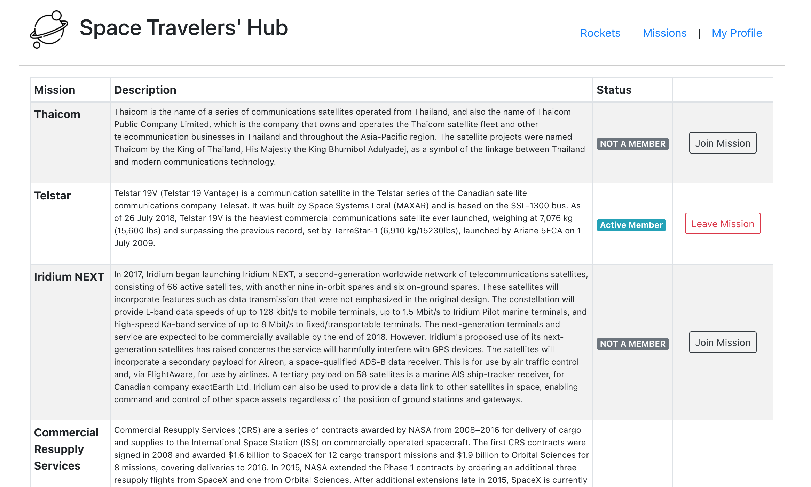

# React & Redux group project - Space Travelers' Hub

## Learning objectives

- Use React documentation
- Use React components
- Use React props
- Use React Router
- Connect React and Redux
- Handle events in a React app
- Write unit tests with React Testing Library
- Use styles in a React app
- Use React hooks
- Apply React best practices and language style guides in code
- Use store, actions and reducers in React
- Perform a code review for a team member

### Estimated time: 20.5h

## Description

In this task, you will be working with the real live data from the SpaceX API. Your task is to build a web application for a company that provides commercial and scientific space travel services. The application will allow users to book rockets and join selected space missions.

### How to build the Space Travelers' Hub

The Space Travelers' Hub consists of _Rockets_, _Missions_, and the _My Profile_ section.

#### Rockets /Dragons

The Rockets section displays a list of all available SpaceX rockets. Users can book each rocket by clicking the reservation button or cancel the previously made booking. The same layout is used to form the Dragons section _[added only if your team has 3 members]_.

<p>
  
</p>

#### Missions

The Missions section displays a list of current missions along with their brief description and participation status. There is also a button next to each mission that allows users to join the selected mission or leave the mission the user joined earlier.

<p>
  
</p>

#### My Profile

The My Profile section displays all reserved rockets and space missions.

<p>
  
</p>

_IMPORTANT NOTE: Read **all** requirements before you start building your project._

### General requirements

- Make sure that there are [no linter errors](https://github.com/microverseinc/linters-config).
- Make sure that you used correct [Gitflow](https://github.com/microverseinc/curriculum-transversal-skills/blob/main/git-github/articles/gitflow.md).
- Make sure that you documented your work [in a professional way](https://github.com/microverseinc/curriculum-transversal-skills/blob/main/documentation/articles/professional_repo_rules.md).

### HTML/CSS & JavaScript requirements

- Follow our list of [best practices for HTML & CSS](https://github.com/microverseinc/curriculum-html-css/blob/main/articles/html_css_best_practices.md).
- Follow our list of [best practices for JavaScript](https://github.com/microverseinc/curriculum-html-css/blob/main/articles/javascript_best_practices.md).

### Project requirements

#### Config & basic setup

- Create a React application using [Create React App](https://reactjs.org/docs/create-a-new-react-app.html#create-react-app)
- Install [React Redux](https://react-redux.js.org/), [Redux Logger](https://www.npmjs.com/package/redux-logger) and [React Router V6](https://reactrouter.com/en/main/start/tutorial).
- Download the [free image](https://www.flaticon.com/free-icon/planet_3212567?term=space&page=1&position=19&page=1&position=19&related_id=3212567&origin=style) for the app logo.
- Create **routes** and **view** components: `rockets`, `missions`, `my profile`. Add `dragons` _[only if your team has 3 members]_).
  - Use `<NavLink />` for the page navigation links and style active class to indicate which section/page user is currently on (underline active navigation link).
- Create directories for all Redux state slice files:`rockets`, `missions`, `dragons` _[only if your team has 3 members]_.

#### Redux: Fetch data and update Redux store

- Upon first render fetch data from the SpaceX API endpoints:
  - Rockets: `https://api.spacexdata.com/v4/rockets`
  - Missions: `https://api.spacexdata.com/v3/missions`
  - Dragons: `https://api.spacexdata.com/v4/dragons` _[only if your team has 3 members]_
- Once the data are fetched, dispatch an action to store the selected data in Redux store:
  - Rockets:
    - `id`
    - `rocket_name`
    - `description`
    - `flickr_images`
  - Missions:
    - `mission_id`
    - `mission_name`
    - `description `
  - Dragons _[only if your team has 3 members]_:
    - `id`
    - `name`
    - `type`
    - `flickr_images`

NOTE: Make sure you only dispatch those actions once and do not add data to store on every re-render (i.e. when changing views / using navigation).

NOTE: _Rockets_ is the default view, so you must fetch _rockets_ data when the application starts. However, the _missions_ data should only be fetched (once) when a user navigates to the _Missions_ section.

#### Render UI:lists

- Use `useSelector()` Redux Hook to select the state slices and render lists of rockets and missions in corresponding routes. i.e.:

```javascript
// get rockets data from the store
const rockets = useSelector((state) => state.rockets)
```

- You can style the whole application "by hand" or you could use [React Bootstrap](https://react-bootstrap.github.io/), a UI library that could speed up the process. This is a popular library and working with its components would be good practice.
- Render a list of rockets (as per design). For the image of a rocket use the first image in the array of `flickr_images`.
- Render a table with the missions' data (as per design).
- Render a list of dragons (as per design). For the image of a dragon use the first image in the array of `flickr_images`_[only if your team has 3 members]_.

#### Redux: Write actions and reducers for booking rockets/dragons and joining missions

- When a user clicks the "Reserve rocket" button or "Reserve dragon" button _[only if your team has 3 members]_, action needs to be dispatched to update the store. You need to get the ID of the reserved rocket and update the state. Remember you mustn't mutate the state. Instead, you need to return a new state object with all rockets, but the selected rocket will have an extra key `reserved` with its value set to `true`. You could use a JS `filter()` or `map()` to set the value of the new state - i.e.:

```javascript
const newState = state.map((rocket) => {
  if (rocket.id !== id) return rocket
  return { ...rocket, reserved: true }
})
```

- Regardless of which method you choose, make sure you place all your logic in the reducer. In the React view file, you should only dispatch the action with the correct rocket ID as an argument.
- Create a reducer and action dispatcher for the "Join Mission" button. The logic here is practically the same as with rockets - you need to pass the mission's ID to the corresponding action and update the missions' state with the selected mission having a new key/value - `reserved: true`.

#### Redux: Write actions and reducers for canceling rockets/dragons and leaving missions

- Here you need to follow the same logic as with the "Reserve rocket"/"Reserve dragon" and "Join mission" - but you need to set the `reserved` key to `false`.
- Dispatch these actions upon click on the corresponding buttons.

#### Render UI: conditional components rendering

- Rockets that have already been reserved should show a "Reserved" badge and "Cancel reservation" button instead of the default "Reserve rocket" (as per design) .
- Dragons that have already been reserved should show a "Reserved" badge and "Cancel reservation" button instead of the default "Reserve dragon" (as per design) _[only if your team has 3 members]_.
- Missions that the user has joined already should show a badge "Active Member" instead of the default "NOT A MEMBER" and a button "Leave Mission" instead of the "Join Mission" button (as per design).
- Rockets/Dragons and Missions should use the React conditional rendering syntax:

```javascript
{rocket.reserved && (
    // render Cancel Rocket button
)}
```

#### Render UI: My Profile section

- Compose two/three column layout and list ONLY the rockets/dragons reserved and missions joined by the user (as per design):
  - Render a list of all joined missions (use `filter()`).
  - Render a list of all reserved rockets (use `filter()`).
  - Render a list of all reserved dragons (use `filter()`) [only if your team has 3 members]\_.

#### Technical set up\*\*

- Set up the repository on GitHub and use Gitflow.
- Set up React and Redux.
- Set up testing libraries(React Testing Library and Jest).
- Do not preserve user data.

### NOTE: Make sure to add test for all your components and functions.

### Workload distribution

In order to tackle this challenge, we created [a template of the Kanban board with GitHub project](https://github.com/microverseinc/curriculum-react-redux/projects/1) that translates the requirements into a set of tasks that you will be able to use to organize your work. You will create your own copy of that board in the separate activity.

You will be working in this way:

- The common tasks (set up repo, shared work on the main page) will be divided among all of you or completed as a team (pair programming).
- The other tasks related to the project will be developed individually. Every student will own tasks from all categories specified in the kanban board in order to practice a variety of skills.
- All tasks should be based on the cards from your Kanban board.

## Work and submission mode

- You should implement the above requirements only in **one repository** in your group.
- You should ask for a review and submit this activity **on behalf of your group.**

## Code review

You will give and receive code reviews from your teammates. Each task should have a separate pull request that is reviewed by one of your teammates.
Once the entire project is ready, one of your team members will request a code review on behalf of your group.
For both proccesses follow [these steps](https://github.com/microverseinc/curriculum-transversal-skills/blob/main/code-review/articles/code_review_flow_group_projects.md).

## Submit your project

After the final approval from a code reviewer, you need to submit your project.
[Read this FAQ for a reminder on how to submit your project](https://microverse.zendesk.com/hc/en-us/articles/360061344234).

Now go to your Student Dashboard and submit your project.

## Additional requirements

_These are all optional, but if you're interested in exploring this topic further, feel free to implement them. Any exploration here should be done outside program time._

_If you decide to implement these requirements you should do it in a separate pull request. As always, remember to clearly document your decision in GitHub comments._

- Enhance the My Profile section by adding a placeholder message when the "My Missions" or "My Rockets" lists are empty (no missions joined or no rockets reserved).
- Enhance the My Profile section by adding the "Cancel reservation" and "Leave Mission" buttons to the lists here. Clicking them should dispatch the actions you have already used in the main Rockets and Missions sections.
- Enhance the My Profile section by adding the "Read more" button for each mission and rocket. Upon click, it should open a corresponding Wikipedia page in a new tab. NOTE - you need to get that extra Wikipedia URL from the API's payload.

**Remember to add cards to your Kanban board if you decide to implement additional tasks.**

---

_If you spot any bugs or issues in this activity, you can [open an issue with your proposed change](https://github.com/microverseinc/curriculum-transversal-skills/blob/main/git-github/articles/open_issue.md)._
