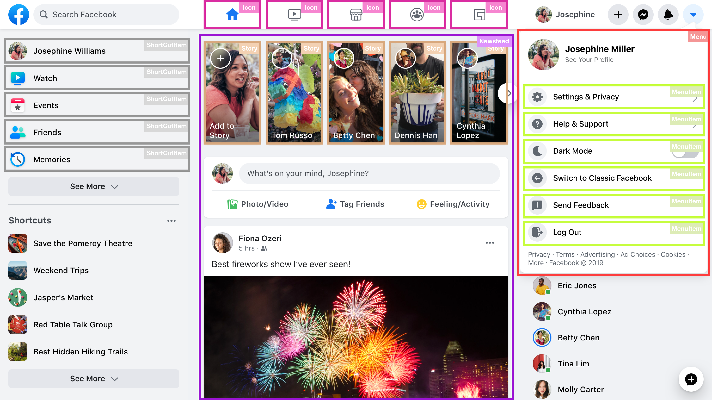

# Components

## Learning objectives

- Use React components.

### Estimated time: 0.5h

## Description

In this lesson, you will learn what React **components** are and how to use them.

### Why are components important?

Components are the building blocks of a React application. They allow you to split your user interface into **reusable** and **independent** pieces that can manage their own state and render themselves.

Different from regular HTML, where you build complete pages using HTML elements, in React you will **identify repeatable parts of a particular page and turn them into reusable components** that can be **composed together** to create a page.

### Component hierarchy

A React application consists of a **component hierarchy**, where components are nested inside other components to form a **tree-like structure**.

Each component in the hierarchy is a parent to its child components, and the child components can in turn have their own child components.


This diagram looks very abstract, so let's take a real life example and see how we can identify components and how they could be nested into each other: the Facebook homepage!



As you can see in the image, there are couple of reusable components:

The Menu section consists of 2 reusable components:

- `<Menu>` - Parent
- `<MenuItem>` - Child

The Newsfeed section consists of at least 2 reusable components:

- `<NewsFeed> - Parent
- `Story` - Child

_Can you identify what other components the page consists of?_

To learn more about how to break the  UI into reusable, independent components:

- [How to break the UI of any website into React components](https://dev.to/efkumah/how-to-break-the-ui-of-any-website-into-react-components-10lc)

### Types of components

Components can be written in 2 ways: using **classes** or **functions**.

- **Class components**

  Uses ES6 `class` syntax, adding some specific React features: **state**, **props**, **lifecycle methods**, and a `render()` method.

  ```jsx
  import React from "react"

  class Example extends React.Component {
    render() {
      return <div>Example</div>
    }
  }
  ```

- **Functional components**

  Regular functions that return JSX.

  ```jsx
  import React from "react"

  function Example() {
    return <div>Example</div>
  }
  ```

As of `React v16.8` it's recommended to only write **functional components**. You might see class components every once in a while, but it's discouraged to use them.

To learn more about components, read these articles:

- [React component guide: Class vs functional](https://www.educative.io/blog/react-component-class-vs-functional)

### Smart vs. dumb components

In order to design clean React components you should **separate your concerns**: data and

This separation is also known as "dumb" and "smart" components, which refers to **the role and responsibility of each component** in the overall architecture of a React application.

"Dumb" components, also known as _presentational_ components, are components that are concerned with:

- How things look (styling)
- They receive data and callbacks exclusively via props
- Dnd don't have any internal state
- They are simple and reusable

"Smart" components, also known as _container_ components, are components that are concerned with:

- How things work (functionality & state)
- They manage the data and behavior, often including state and side-effects
- They provide data and actions to dumb components via props

The goal is to create a separation of concerns between the two types of components and make the application more maintainable and scalable.

```jsx
import { useState } from "react"

function Counter(props) {
  const { count, increment, decrement } = props

  return (
    <div>
      <p>{count}</p>
      <button onClick={increment}>Increase</button>
      <button onClick={decrement}>Decrease</button>
    </div>
  )
}

function CounterContainer() {
  const [count, setCount] = useState(0)

  const increment = () => setState(count + 1)

  const decrement = () => setState(count - 1)

  return <Counter count={count} increment={increment} decrement={decrement} />
}
```

## Additional materials

**These are all optional, but if you're interested in exploring this topic further, here are some resources to help you. Any exploration here should be done outside program time.**

- [Thinking in React](https://beta.reactjs.org/learn/thinking-in-react)

_If you spot any bugs or issues in this activity, you can [open an issue with your proposed change](https://github.com/microverseinc/curriculum-transversal-skills/blob/main/git-github/articles/open_issue.md)._