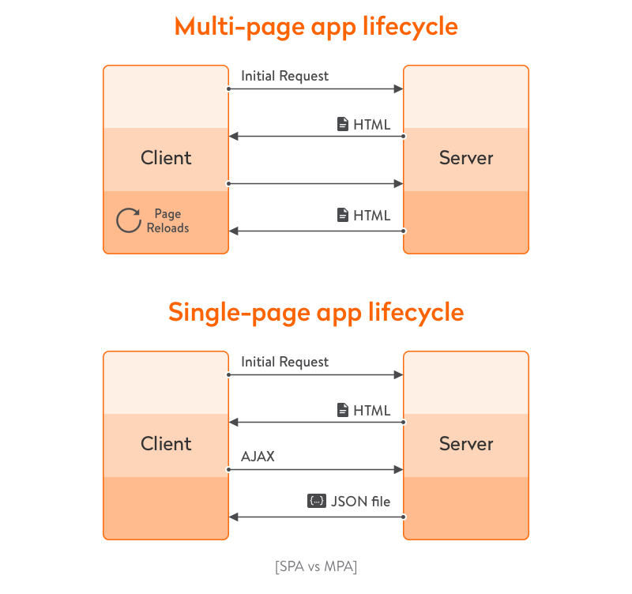

# What is a Single Page App?

## Learning objectives

- Understand the concept of Single Page Application.

### Estimated time: 0.5h

## Description

In this lesson, you will deepen your knowledge about **Single Page Applications (SPAs)**. Single Page Applications were briefly introduced in [module 2](https://github.com/microverseinc/curriculum-javascript/blob/main/books/lessons/lesson_intro_spa.md#single-page-applications); now you will learn more about them.

### Why is a SPA important?

The traditional client-server model requires that **a browser sends out an HTTP request to the server whenever there is a page change**. These applications are called `static sites`, or `multi page applications (MPA)`.

This model works just fine, but there are some **disadvantages**:

- The user has to wait until the content has loaded.
- While desktop or native apps offer a continuous workflow, browser pages are constantly interrupted.
- Sometimes you only need to download a small piece of data, not the whole page.

A SPA attemps to solve these problems in the following ways:

- Download the HTML, CSS, and JavaScript needed to have a fully working page, only in the first page load.
- When needed, send or receive small amounts of data using AJAX, not HTML.
- Update only the content that needs to be updated.
- It's possible to _lazy load_ (load only when strictly necessary, or _later_) additional assets like images or scripts.

The traditional MPA vs SPA lifecycle can be summarized with this diagram:

  

Image credit: https://yalantis.com/blog/single-page-apps-vs-multiple-page-apps/

- [Understanding Single Page Applications and Multi Page Applications](https://www.youtube.com/watch?v=ZEpfiGu1f8g)

### SPA and AJAX

**Asynchronous JavaScript and XML** (AJAX) is a set of technologies that, when used together, enable a web app to make an HTTP request without reloading the whole page. They achieve this by sending and receiving data in an _asynchronous_ way. AJAX is not new, it's been in use since 1998, when the [XMLHttpRequest](https://developer.mozilla.org/en-US/docs/Web/API/XMLHttpRequest) was introduced, and it has evolved a lot since then. Some years ago, it was common to directly use the XMLHttpRequest object with vanilla JavaScript, or use the very popular [jQuery ajax()](https://www.w3schools.com/jquery/ajax_ajax.asp) method. Nowadays, newer libraries are very popular, like [Axios](https://axios-http.com/). But, in fact, you can make asynchronous requests just using the new [fetch API](https://developer.mozilla.org/en-US/docs/Web/API/Fetch_API) (which is supported by all modern browsers) combined with _async functions_ (using `async` and `await`) or _Promises_ (using `then()` and `catch()` methods).

Some useful tips about AJAX:

- The term AJAX is used, in general, to talk about asynchronous requests.
- You can work with JSON or XML, not just XML.
- Most likely, you are not going to work with the XMLHttpRequest object directly.
- We recommend you work directly with the `fetch` API, since it's a fully supported standard.

### Libraries and frameworks to develop SPA

You can develop a SPA with only vanilla JavaScript, but that would mean a lot of work. To avoid reinventing the wheel, you can use a library or framework that will help you bootstrap your project and will give you the main features you need _out-of-the-box_. There are several options, the most popular of which are:

- [React](https://reactjs.org/)
- [Angular](https://angular.io/)
- [Vue](https://vuejs.org/)

In this module, you will learn how to work with **React**. All the frameworks listed are great, but we have chosen React because:

- It's the most popular
- Has a big community
- Easy to use documentation
- Lots of learning resources
- Its ecosystem offers everything you need to add additional features
- There is a great demand for React developers in the labor market

### SPA pages

A Single Page Application consists of a single page, but that doesn't mean you can't have several pages or sections. Technically, it's possible to develop an application as one page but to offer users and search engines a way to index and categorize your content. To create several pages in a Single Page Application you can use _routes_.

A traditional web site has several pages, **identified by the URL**. For example, you can have:

- `http://www.mycoolpage.com/home`
- `http://www.mycoolpage.com/about`
- `http://www.mycoolpage.com/contact`

SPAs can work with different URLs (modifying the `/home`, `/about`, or `/contact` part, in our example) using a **router**, which is software that modifies the URL of the browser. There are several routers available. You will learn about [React Router](https://reactrouter.com/en/main) in a following lesson.

### Cons of SPAs

SPAs can help you offer a more natural, continuous experience to users, but they also introduce some new problems. The **main problems** are:

- **Search Engine Optimization**

  Since the content of the page is generated or modified dynamically, search engines may have issues indexing your pages.

- **JavaScript is mandatory**

  In the (unusual, but possible) case of a browser not supporting JavaScript, the whole page will be unusable.

These problems can be solved, and there are tools you can use for it, but you should be aware of the potential pitfalls of SPAs and the strategies to fix them.

---

_If you spot any bugs or issues in this activity, you can [open an issue with your proposed change](https://github.com/microverseinc/curriculum-transversal-skills/blob/main/git-github/articles/open_issue.md)._
