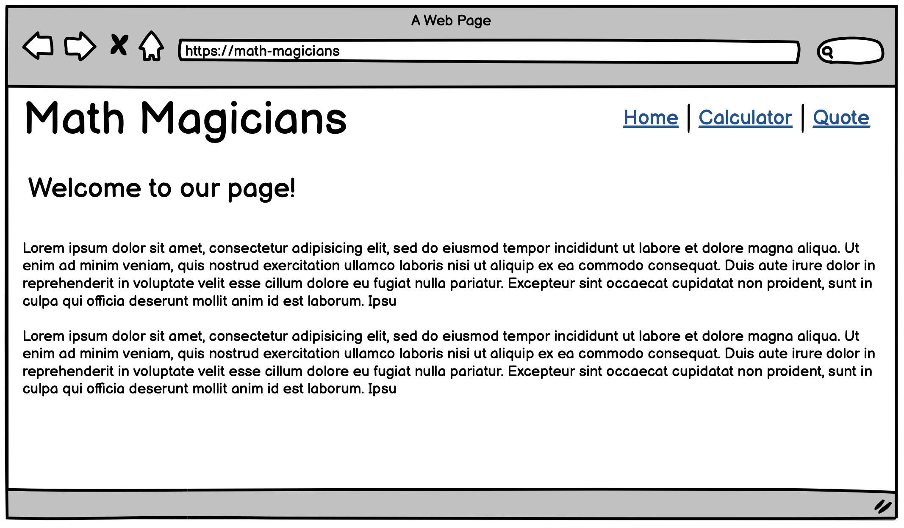

# Math magicians: full website

## Learning objectives

- Use React Router.
- Use styles in a React app.

### Estimated time: 3.5h

## Description

In this project, you will create a full website for the Math magicians app, consisting of several pages and using the components you already created.

### General requirements

- Make sure that there are [no linter errors](https://github.com/microverseinc/linters-config).
- Make sure that you used correct [Gitflow](https://github.com/microverseinc/curriculum-transversal-skills/blob/main/git-github/articles/gitflow.md).
- Make sure that you documented your work [in a professional way](https://github.com/microverseinc/curriculum-transversal-skills/blob/main/documentation/articles/professional_repo_rules.md).

### JavaScript requirements

- Follow our list of [best practices for JavaScript](https://github.com/microverseinc/curriculum-html-css/blob/main/articles/javascript_best_practices.md).

### Project requirements

In previous projects, you created the core functionality of the app: a **Calculator component**. Now you should develop a full website with several pages.

- Create a website consisting of 3 pages: `Home`, `Calculator`, and `Quote`.
- The general layout should match these wireframes:

  
  
  

- Add your own styles to improve the look and feel.
  - In the lesson about styling, we introduced several ways to add styles in a React application:
    - React basic styling (inline styles, importing CSS and pre-processed CSS files).
    - CSS modules.
    - Styled components.
  - In this project, you should use **React basic styling**.
- For every page, you should create a _route_.
- Make sure that navigation links for all 3 routes are displayed on each page.
- Use [React Router](https://reactrouter.com/) to make the routes work.

### Need a big picture?

Remind me about [the big picture of this project](./sneak_peek.md).

## Work and submission mode

- You should submit this activity **individually.**

## Code review

Follow [these steps](https://github.com/microverseinc/curriculum-transversal-skills/blob/main/code-review/articles/how_to_ask_for_a_code_review.md) to request a code review of your project.

## Submit your project

After the final approval from a code reviewer, you need to submit your project.
[Read this FAQ for a reminder on how to submit your project.](https://microverse.zendesk.com/hc/en-us/articles/360061344234)
Now go to your Student Dashboard and submit your project.

---

_If you spot any bugs or issues in this activity, you can [open an issue with your proposed change](https://github.com/microverseinc/curriculum-transversal-skills/blob/main/git-github/articles/open_issue.md)._
