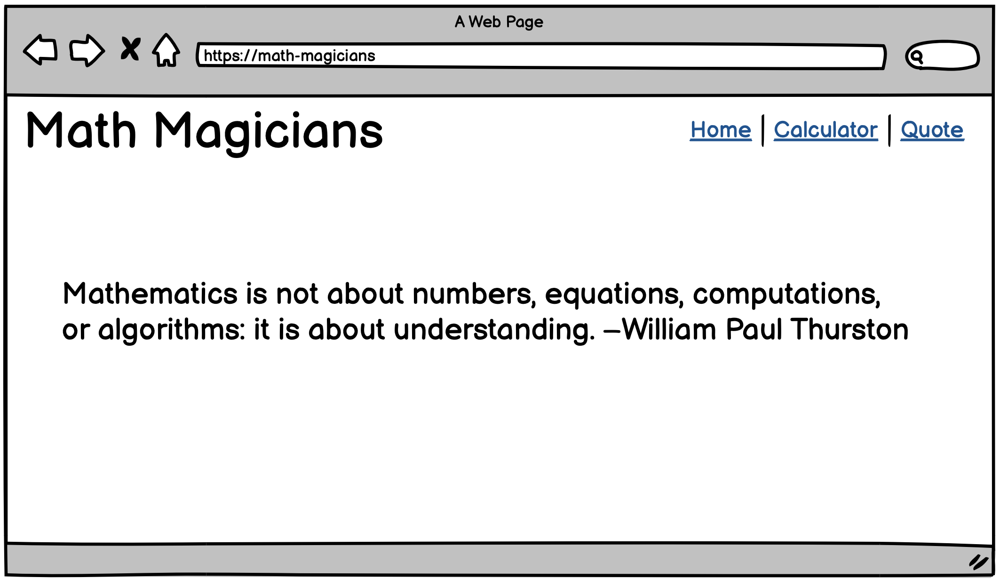

# Sneak peek: Math magicians

## Learning objectives
- Understand how to use medium-fidelity wireframes to create a UI.

### Estimated time: 0.5h

## Description

"Math magicians" is a website for all fans of mathematics. It is a Single Page App (SPA) that allows users to:
- Make simple calculations.
- Read a random math-related quote.

By building this application, you will learn how to use React.

### How to build the "Math magicians" website

You will start by building the core functionality, which is a calculator. At the very beginning your website will contain only the simple UI presented below, but it will be able to perform all math operations. 

  

Once the calculator is ready you will use it as a part of a full website that includes 3 sub-pages:

  
  
  

### Projects list

You will be building your "Math magicians" website for more than a whole week. Here is the list of projects that will guide you through the steps described above. You will find details about each of the project requirements in the upcoming program activities. In some of the projects, you will be working collaboratively by using pair programming.

- Project 1: Setup.
- Project 2: Components.
- Project 3: Events.
- Project 4: Fetch data from API.
- Project 5: Full website.
- Project 6: Tests (pair programming).
- Exercise: Deploy.

------

_If you spot any bugs or issues in this activity, you can [open an issue with your proposed change](https://github.com/microverseinc/curriculum-transversal-skills/blob/main/git-github/articles/open_issue.md)._
