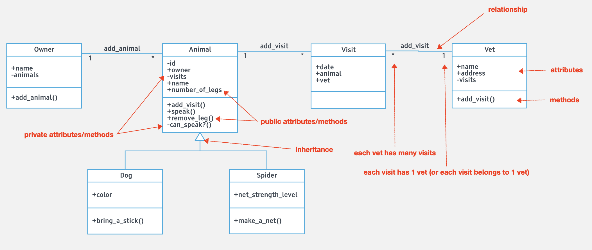

# Association, aggregation, and composition by examples

In this article, we are going to build on top of what we did in ["Composition by examples"](./composition_by_examples.md) and create classes and relationships based on a UML class diagram.

While reading this article, create your files with classes and try some code in your IRB console. Keep the files you create saved for upcoming lessons.

### The UML class diagram
The diagram below shows the classes (with their attributes and methods) and the relationships between them.



### Has many relationships

Taking a look at the diagram you can see 3 *has many* relationships:
- `Owner` has many `Animal`s
- `Animal` has many `Visit`s
- `Vet` has many `Visit`s

But actually, the ones involving `Visit` are part of a *many-to-many* of `Animal` and `Vet`. So for now, we will do the remaining relationship, which is a simple *has many*.

We are going to create a file `owner.rb` which defines the `Owner` class with attributes `@name` and `@animals`. That attribute `@animals` is what holds the relationship and to manage it we will also create a method `add_animals` to add animals to it. So this class ends up looking like this:

```ruby
class Owner
  attr_accessor :name
  attr_reader :animals

  def initialize(name)
    @name = name
    @animals = []
  end

  # Instead of setter for entire collection a method to add animals one by one
  def add_animal(animal)
    @animals.push(animal)
  end
end
```

Now you can have an owner and give it animals.

<details>
<summary>Try it out in your IRB console</summary>

```ruby
require "./animal.rb"
require "./dog.rb"
require "./spider.rb"
require "./owner.rb"

dog = Dog.new("black", "Rax")
spider = Spider.new(85, "Bob")
animal = Animal.new("lion", 4, "Some name")

alex = Owner.new("Alex")
alex.animals
alex.add_animal(dog)
alex.animals
alex.add_animal(spider)
alex.animals
alex.add_animal(animal)
alex.animals.map {|animal| animal.name}

alex.animals.count
alex.animals.first.name
alex.animals.first.number_of_legs
```
</details>

### Belongs to relationships

If you take a look at the diagram you will see the 3 possible *belong to* relationships, the opposite end of the *has many* ones. Again, we will only tackle the `Animal`s belongs to `Owner` relationship.

To make this relationship possible we only need to add an `attr_accessor` for `@owners` in `Animal` (`animal.rb`).

```ruby
...

class Animal
  attr_accessor :owner

  ...
end
```

<details>
<summary>Try it out in your IRB console</summary>

```ruby
require "./animal.rb"
require "./dog.rb"
require "./spider.rb"
require "./owner.rb"

dog = Dog.new("black", "Rax")
spider = Spider.new(85, "Bob")
animal = Animal.new("lion", 4, "Some name")

alex = Owner.new("Alex")
alex.animals
alex.add_animal(dog)
alex.animals
alex.add_animal(spider)
alex.animals
alex.add_animal(animal)

alex.animals.last.owner.name

animal.owner
animal.owner = alex
animal.owner
animal.owner.name

alex.animals.last.owner.name
```
</details>

### Both ways relationships

You might have noticed that although the relationship should go both ways immediately it doesn't. To fix this you need to add the animal to the owner and then add the owner to the animal. This easily presents a problem in which a programmer can forget about this and the object results in a not-updated state.

To fix this we adapt our solution to manage both sides of the relationship in both cases. We need to modify our implementations of `add_animal` in `Owner` and create our setter for `@owner` in `Animal.

In `owner.rb`

```ruby
class Owner
  ...

  def add_animal(animal)
    @animals.push(animal)
    animal.owner = self
  end
end
```

In `animal.rb`

```ruby
class Animal
  attr_reader :owner

  ...

  def owner=(owner)
    @owner = owner
    owner.animals.push(self) unless owner.animals.include?(self)
  end

  ...
end
```

Now any time we add an animal to an owner the owner of the animal is set as well, and vice versa.

<details>
<summary>Try it out in your IRB console</summary>

```ruby
require "./animal.rb"
require "./dog.rb"
require "./spider.rb"
require "./owner.rb"

dog = Dog.new("black", "Rax")
spider = Spider.new(85, "Bob")
animal = Animal.new("lion", 4, "Some name")

alex = Owner.new("Alex")
alex.animals

dog.owner
alex.add_animal(dog)
dog.owner
dog.owner.name
alex.animals

spider.owner
alex.add_animal(spider)
spider.owner
spider.owner.name
alex.animals

animal.owner
alex.add_animal(animal)
animal.owner
animal.owner.name


alex.animals.count
alex.animals.first.name
alex.animals.first.number_of_legs


second_animal = Animal.new("cat", 4, "Kitty")
second_animal.owner
alex.animals.count

second_animal.owner = alex

second_animal.owner
alex.animals.count
alex.animals.last
alex.animals.last.name
```
</details>

### Many-to-many relationship

Finally, we are going to tackle the *many-to-many* relationship between `Animal` and `Vet`. This relationship is done through the class `Visit` which besides having the `@animal` and `@vet` involved it also has `@date`.

First, let's create the `Vet` class in a file named `vet.rb`. We will initialize an empty list for the visits and a getter for it, and later you will see how we put elements in it:

```ruby
class Vet
  attr_reader :visits
  attr_accessor :name, :address

  def initialize(name, address)
    @name = name
    @address = address
    @visits = []
  end
end
```

Now let's modify the `Animal` class in `animal.rb` to include `@visits` and a getter for it:

```ruby
...

class Animal
  attr_reader :owner, :visits

  def initialize(type, number_of_legs, name = "Unknown")
    @id = Random.rand(1..1000)
    @name = name
    @number_of_legs = number_of_legs
    @type = type
    @liked_food = NoFood.new()
    @visits = []
  end

  ...
end
```

And last, we create the class `Visit` in a file named `visit.rb`. This class will have 3 attributes `@date`, `@animal`, and `@vet`. All of them will be given as part of the constructor and at the same time we will add the visit to `@visits` of the animal and vet:

```ruby
class Visit
  attr_reader :animal, :vet
  attr_accessor :date

  def initialize(date, animal, vet)
    @date = date

    @animal = animal
    animal.visits << self

    @vet = vet
    vet.visits << self
  end
end
```

And that's it. We implemented the entire UML class diagram relationship.

```ruby
require "./animal.rb"
require "./dog.rb"
require "./spider.rb"
require "./owner.rb"
require "./visit.rb"
require "./vet.rb"

dog = Dog.new("black", "Rax")
spider = Spider.new(85, "Bob")

vet_maria = Vet.new("Maria", "New York")
vet_john = Vet.new("John", "San Francisco")

visit_1 = Visit.new("2017-12-22", dog, vet_maria)
visit_2 = Visit.new("2017-12-31", dog, vet_maria)

dog.visits.count
dog.visits.map { |visit| visit.date }
vet_john.visits.count
vet_maria.visits.count
vet_maria.visits.map { |visit| visit.animal.name }

visit_3 = Visit.new("2017-11-11", spider, vet_john)
visit_4 = Visit.new("2017-10-10", spider, vet_maria)

spider.visits.count
spider.visits.map { |visit| visit.date }
vet_john.visits.count
vet_john.visits.map { |visit| visit.animal.name }
vet_maria.visits.count
vet_maria.visits.map { |visit| visit.animal.name }
```
</details>

------

_If you spot any bugs or issues in this activity, you can [open an issue with your proposed change](https://github.com/microverseinc/curriculum-transversal-skills/blob/main/git-github/articles/open_issue.md)._
